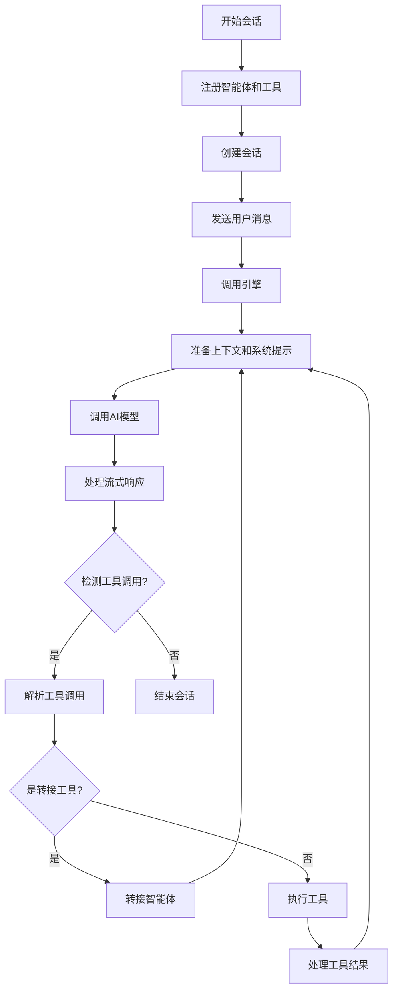

# ExpoAgentCore 库实现过程

## 1. 库概述

ExpoAgentCore 是一个用于构建和管理 AI 智能体系统的核心库，支持多智能体协作、工具调用和流式交互。它提供了完整的会话管理、智能体注册、工具集成和工作流控制功能。

### 主要特性

- ✅ 多智能体注册与管理
- ✅ 会话状态管理
- ✅ 工具调用支持
- ✅ 智能体间转接
- ✅ 流式响应处理
- ✅ 错误处理与日志记录

## 2. 架构设计

### 2.1 系统架构图

## 系统架构层次结构

```
┌─────────────────────────────────────────────────────────────────────────┐
│                           ExpoAgentCore                                 │
│                    (智能体系统主入口类)                                 │
├─────────────────┬─────────────────┬─────────────────┬─────────────────┤
│   Registry      │  StateManager   │ NetworkClient   │     Engine      │
│  (注册中心)     │   (状态管理)    │  (网络通信)     │   (核心引擎)    │
├─────────────────┼─────────────────┼─────────────────┼─────────────────┤
│ agents: Map     │ sessions: Map   │ config:         │ network:        │
│   <string,      │   <string,      │   CoreConfig    │   NetworkClient │
│   AgentConfig>  │   Session>      │                 │                 │
│                 │                 │                 │ state:          │
│ tools: Map      │                 │ EventSource     │   StateManager  │
│   <string,      │                 │   流式通信      │                 │
│   ToolConfig>   │                 │                 │ registry:       │
│                 │                 │                 │   Registry      │
└─────────────────┴─────────────────┴─────────────────┴─────────────────┘
                                │
                                ▼
┌─────────────────────────────────────────────────────────────────────────┐
│                             工具库 (utils/)                             │
├─────────────────┬───────────────────────────────────────────────────────┤
│    Logger       │                    Parsers                            │
│   (日志工具)    │                   (解析工具)                          │
├─────────────────┼───────────────────────────────────────────────────────┤
│  info()         │ buildSystemPrompt()                                   │
│  error()        │ parseToolCall()                                       │
│  warn()         │                                                       │
└─────────────────┴───────────────────────────────────────────────────────┘
                                │
                                ▼
┌─────────────────────────────────────────────────────────────────────────┐
│                           类型系统 (types.ts)                          │
├─────────────────┬─────────────────┬─────────────────┬─────────────────┤
│   ChatMessage   │   AgentConfig   │   CoreConfig    │  ToolProperty   │
│     Role        │   ToolConfig    │ WorkflowEvents  │   ToolParams    │
└─────────────────┴─────────────────┴─────────────────┴─────────────────┘
```

## 核心组件依赖关系

```
ExpoAgentCore
    ├── 初始化 → Registry, StateManager, NetworkClient, Engine
    ├── 注册智能体 → Registry.registerAgent()
    ├── 注册工具 → Registry.registerTool()
    └── 创建会话 → StateManager.createSession()

Engine (工作流引擎)
    ├── 依赖注入 → NetworkClient, StateManager, Registry
    ├── 执行流程 → 获取会话 → 构建提示 → 网络请求 → 解析工具调用
    ├── 工具调用 → Registry.getTool() → 工具执行 → 状态更新
    └── 智能体转接 → Registry.getAgent() → StateManager.setCurrentAgent()

Registry (注册中心)
    ├── 智能体管理 → registerAgent(), getAgent()
    ├── 工具管理 → registerTool(), getTool()
    └── 动态工具生成 → getToolsForAgent()

StateManager (状态管理)
    ├── 会话管理 → createSession(), getSession()
    ├── 消息历史 → addMessage(), getHistory()
    └── 当前智能体 → setCurrentAgent()

NetworkClient (网络通信)
    ├── 配置管理 → CoreConfig
    └── 流式通信 → EventSource 实现
```

### 2.2 核心组件关系图

## 核心组件交互图

```
┌─────────────────────────────────────────────────────────────────────────┐
│                           用户交互层                                    │
│                                                                         │
│    ┌─────────────┐    调用方法          ┌─────────────┐                │
│    │   用户输入   │ ──────────────→ │ ExpoAgentCore  │                │
│    └─────────────┘                    └─────────────┘                │
│                                           │ 注册/创建/执行            │
└─────────────────────────────────────────────────────────────────────────┘
                                           │
                                           ▼
┌─────────────────────────────────────────────────────────────────────────┐
│                          核心处理层                                     │
│                                                                         │
│    ┌─────────────┐    ┌─────────────┐    ┌─────────────┐                │
│    │   Engine    │ ←→ │  Registry   │ ←→ │ StateManager│                │
│    └─────────────┘    └─────────────┘    └─────────────┘                │
│         │                    │                    │                     │
│         ▼                    ▼                    ▼                     │
│    ┌─────────────┐    ┌─────────────┐    ┌─────────────┐                │
│    │ Network     │    │   智能体     │    │   会话      │                │
│    │  Client     │    │   配置       │    │   状态      │                │
│    └─────────────┘    └─────────────┘    └─────────────┘                │
└─────────────────────────────────────────────────────────────────────────┘
                                           │
                                           ▼
┌─────────────────────────────────────────────────────────────────────────┐
│                          工具层                                         │
│                                                                         │
│    ┌─────────────┐    ┌─────────────┐    ┌─────────────┐                │
│    │   Logger    │ ←→ │   Parsers   │ ←→ │   工具      │                │
│    └─────────────┘    └─────────────┘    └─────────────┘                │
│         │                    │                    │                     │
│         ▼                    ▼                    ▼                     │
│    ┌─────────────┐    ┌─────────────┐    ┌─────────────┐                │
│    │  日志记录    │    │  提示构建    │    │  工具执行    │                │
│    │  错误处理    │    │  调用解析    │    │  结果返回    │                │
│    └─────────────┘    └─────────────┘    └─────────────┘                │
└─────────────────────────────────────────────────────────────────────────┘

数据流向说明:
● 实线箭头 → 表示直接调用关系
● 双向箭头 ←→ 表示相互依赖关系
● 虚线箭头 ⇢ 表示数据流动方向

关键交互:
1. 用户输入 → ExpoAgentCore → Engine (工作流启动)
2. Engine → Registry (获取智能体配置) → StateManager (更新会话状态)
3. Engine → NetworkClient (API调用) → 外部AI服务
4. Engine → 工具执行 → StateManager (记录结果)
5. 智能体转接: Engine → Registry → StateManager (切换当前智能体)
```

### 2.3 message说明

```typescript
export interface ChatMessage {
  id: string; // 唯一ID
  role: Role; // 角色 （system、user、assistant、tool）注意这个角色：角色的类型很重要，很多模型会根据角色来判断是否需要响应，比如system角色的消息一般不会被模型响应，如果是user角色的消息，模型大概率会正确响应，所以在发送请求时，将tool角色的消息伪装成user角色的消息，在处理转接 (Handoff)后，会新增一个system角色的消息，记录下转接的信息，告知AI前因后果，但是这时候会导致一些模型无法响应正确结果，所以在记录下这条消息后会再新增一个tool角色消息（tool后面会伪装成user）
  content: string; // 消息内容
  name?: string; // 可选的发送者名称
  agentId?: string; // 可选的智能体ID，用于记录消息是由哪个智能体发送的
  timestamp: number; // 消息发送时间戳
}
```

## 3. 核心组件实现

### 3.1 类型系统 (types.ts)

首先定义所有核心类型，确保类型安全和代码一致性：

```typescript
export type Role = 'system' | 'user' | 'assistant' | 'tool';

export interface ChatMessage {
  id: string;
  role: Role;
  content: string;
  name?: string;
  agentId?: string;
  timestamp: number;
}

export interface ToolProperty {
  type: string;
  description?: string;
  enum?: any[];
  items?: ToolProperty;
  properties?: { [key: string]: ToolProperty };
}

export interface ToolParams {
  type: 'object';
  properties: { [key: string]: ToolProperty };
  required?: string[];
}

export interface ToolConfig {
  id: string;
  name: string;
  description: string;
  parameters: ToolParams;
  handler: (args: any, context: ExecutionContext) => Promise<any> | any;
  targetAgentId?: string;
}

export interface AgentConfig {
  id: string;
  name: string;
  description: string;
  systemPrompt: string;
  model?: string;
  temperature?: number;
  maxTokens?: number;
  tools?: string[];
  handoffs?: string[];
}

export interface ExecutionContext {
  sessionId: string;
  currentAgentId: string;
  history: ChatMessage[];
}

export interface CoreConfig {
  apiKey: string;
  baseURL?: string;
  defaultModel?: string;
  timeout?: number;
  maxRetries?: number;
}

export interface WorkflowEvents {
  onStart?: () => void;
  onTextDelta?: (text: string, agentId: string) => void;
  onToolCall?: (toolName: string, args: any, agentId: string) => void;
  onToolResult?: (toolName: string, result: any) => void;
  onAgentChange?: (fromAgentId: string, toAgentId: string) => void;
  onComplete?: () => void;
  onError?: (error: Error) => void;
}
```

### 3.2 注册中心 (registry.ts)

管理智能体和工具的注册与获取：

```typescript
export class Registry {
  private agents: Map<string, AgentConfig> = new Map();
  private tools: Map<string, ToolConfig> = new Map();

  registerAgent(agent: AgentConfig) {
    this.agents.set(agent.id, agent);
  }

  registerTool(tool: ToolConfig) {
    this.tools.set(tool.id, tool);
  }

  getAgent(id: string): AgentConfig | undefined {
    return this.agents.get(id);
  }

  getTool(id: string): ToolConfig | undefined {
    return this.tools.get(id);
  }

  getToolsForAgent(agentId: string): ToolConfig[] {
    const agent = this.agents.get(agentId);
    if (!agent) return [];

    const result: ToolConfig[] = [];

    // 1. 添加普通工具
    if (agent.tools) {
      agent.tools.forEach(toolId => {
        const tool = this.tools.get(toolId);
        if (tool) result.push(tool);
      });
    }

    // 2. 动态生成转接工具
    if (agent.handoffs) {
      agent.handoffs.forEach(targetId => {
        const targetAgent = this.agents.get(targetId);
        if (targetAgent) {
          result.push({
            id: `transfer_to_${targetId}`,
            name: `transfer_to_${targetAgent.name.replace(/\s+/g, '_')}`,
            description: `Transfer the conversation to ${targetAgent.name}. Role: ${targetAgent.description}`,
            parameters: {
              type: 'object',
              properties: {
                reason: {
                  type: 'string',
                  description: 'The specific reason for transferring context to this agent.'
                }
              },
              required: ['reason']
            },
            handler: () => ({ status: 'transferred' }),
            targetAgentId: targetId
          });
        }
      });
    }

    return result;
  }
}
```

### 3.3 状态管理器 (state.ts)

管理会话和消息历史：

```typescript
export class StateManager {
  private sessions: Map<string, Session> = new Map();

  createSession(id: string, initialAgentId: string) {
    this.sessions.set(id, {
      id,
      messages: [],
      currentAgentId: initialAgentId,
      updatedAt: Date.now()
    });
  }

  getSession(id: string): Session | undefined {
    return this.sessions.get(id);
  }

  getHistory(id: string): ChatMessage[] {
    return this.sessions.get(id)?.messages || [];
  }

  addMessage(id: string, msg: Omit<ChatMessage, 'id' | 'timestamp'>) {
    const session = this.sessions.get(id);
    if (session) {
      session.messages.push({
        ...msg,
        id: Math.random().toString(36).substring(7),
        timestamp: Date.now()
      });
      session.updatedAt = Date.now();
    }
  }

  setCurrentAgent(id: string, agentId: string) {
    const session = this.sessions.get(id);
    if (session) {
      session.currentAgentId = agentId;
      session.updatedAt = Date.now();
    }
  }
}
```

### 3.4 网络客户端 (network.ts)

处理与 AI 模型的通信：

```typescript
export class NetworkClient {
  constructor(private config: CoreConfig) {}

  /**
   * 流式聊天请求
   */
  async stream(
    messages: ChatMessage[],
    systemPrompt: string,
    model: string,
    temperature: number,
    callbacks: {
      onDelta: (text: string) => void;
      onError: (err: any) => void;
    },
    signal?: AbortSignal
  ): Promise<string> {
    return new Promise((resolve, reject) => {
      // 构建 OpenAI 格式消息
      const apiMessages = [
        { role: 'system', content: systemPrompt },
        ...messages.map(m => ({
          role: m.role === 'tool' ? 'user' : m.role, // 兼容性转换
          content: m.content
        }))
      ];

      const url = `${this.config.baseURL || DEFAULT_BASE_URL}/chat/completions`;
      
      const es = new EventSource(url, {
        method: 'POST',
        headers: {
          'Content-Type': 'application/json',
          'Authorization': `Bearer ${this.config.apiKey}`,
        },
        body: JSON.stringify({
          model: model || DEFAULT_MODEL,
          messages: apiMessages,
          stream: true,
          temperature: temperature,
        }),
      });

      let fullText = '';
      let isDone = false;

      const cleanup = () => {
        es.removeAllEventListeners();
        es.close();
      };

      // 监听外部取消信号
      if (signal) {
        signal.addEventListener('abort', () => {
          cleanup();
          reject(new Error('Request aborted'));
        });
      }

      es.addEventListener('message', (event: any) => {
        if (isDone) return;

        if (event.data === '[DONE]') {
          isDone = true;
          cleanup();
          resolve(fullText);
          return;
        }

        try {
          const parsed = JSON.parse(event.data);
          const delta = parsed.choices?.[0]?.delta?.content;
          if (delta) {
            fullText += delta;
            callbacks.onDelta(delta);
          }
        } catch (e) {
          // 忽略解析错误
        }
      });

      es.addEventListener('error', (event: any) => {
        if (!isDone) {
          if (fullText.length > 0) {
             isDone = true;
             cleanup();
             resolve(fullText);
          } else {
             cleanup();
             callbacks.onError(event);
             reject(new Error('Stream connection error'));
          }
        }
      });
    });
  }
}
```

### 3.5 引擎 (engine.ts)

核心工作流处理逻辑：

```typescript
export class Engine {
  private abortController: AbortController | null = null;

  constructor(
    private network: NetworkClient,
    private state: StateManager,
    private registry: Registry
  ) {}

  public stop() {
    if (this.abortController) {
      Logger.info('Engine', '用户手动停止执行');
      this.abortController.abort();
      this.abortController = null;
    }
  }

  public async run(options: RunOptions, events: WorkflowEvents) {
    this.abortController = new AbortController();
    const { sessionId, input, maxSteps = 15 } = options;

    if (events.onStart) events.onStart();
    Logger.info('Engine', `开始工作流 Session: ${sessionId}`, { input });

    try {
      let session = this.state.getSession(sessionId);
      if (!session) throw new Error(`Session ${sessionId} not found`);

      // 记录用户消息
      this.state.addMessage(sessionId, {
        role: 'user',
        content: input,
        name: 'User'
      });

      let step = 0;
      // 核心循环状态机
      while (step < maxSteps) {
        if (this.abortController.signal.aborted) break;
        step++;

        const currentAgentId = session.currentAgentId;
        const agent = this.registry.getAgent(currentAgentId);
        if (!agent) throw new Error(`Agent ${currentAgentId} not found`);

        Logger.info('Loop', `Step ${step}: 当前 Agent [${agent.name} (${currentAgentId})]`);

        // 1. 准备上下文
        const history = this.state.getHistory(sessionId);
        const availableTools = this.registry.getToolsForAgent(currentAgentId);
        const systemPrompt = buildSystemPrompt(agent.systemPrompt, availableTools);

        // 2. 调用 LLM
        let responseContent = '';
        
        try {
          responseContent = await this.network.stream(
            history,
            systemPrompt,
            agent.model!,
            agent.temperature ?? 0.5,
            {
              onDelta: (text) => {
                if (events.onTextDelta) events.onTextDelta(text, currentAgentId);
              },
              onError: (e) => {
                if (events.onError) events.onError(e);
              }
            },
            this.abortController.signal
          );
        } catch (error) {
          if (this.abortController.signal.aborted) break;
          throw error;
        }

        // 3. 记录 LLM 回复
        this.state.addMessage(sessionId, {
          role: 'assistant',
          content: responseContent,
          name: agent.name,
          agentId: currentAgentId
        });

        // 4. 解析工具调用
        const toolCall = parseToolCall(responseContent);

        if (toolCall) {
          // === 分支 A: 发现工具调用 ===
          Logger.info('Parser', `检测到工具调用: ${toolCall.name}`, toolCall.args);
          
          if (events.onToolCall) {
             events.onToolCall(toolCall.name, toolCall.args, currentAgentId);
          }

          const toolConfig = availableTools.find(t => t.name === toolCall.name);

          if (!toolConfig) {
             // 工具不存在错误处理
             this.state.addMessage(sessionId, {
               role: 'user',
               content: `System Error: Tool "${toolCall.name}" not found.`,
               name: 'System'
             });
             continue;
          }

          // 4.1 处理转接 (Handoff)
          if (toolConfig.targetAgentId) {
            const fromAgent = currentAgentId;
            const toAgentId = toolConfig.targetAgentId;
            
            Logger.info('Engine', `🔄 正在转接: ${fromAgent} -> ${toAgentId}`);
            
            this.state.setCurrentAgent(sessionId, toAgentId);
            session = this.state.getSession(sessionId)!;

            // 插入系统消息
            this.state.addMessage(sessionId, {
              role: 'system',
              content: `[System]: Task transferred from ${agent.name} to ${toolConfig.name}. Context: ${JSON.stringify(toolCall.args)}`,
              name: 'System'
            });

            if (events.onAgentChange) events.onAgentChange(fromAgent, toAgentId);
            continue;
          } 
          
          // 4.2 处理普通工具
          else {
            Logger.info('Tool', `执行工具: ${toolConfig.name}...`);
            try {
              const result = await toolConfig.handler(toolCall.args, {
                sessionId,
                currentAgentId,
                history
              });
              
              Logger.info('Tool', `工具执行成功`, result);
              if (events.onToolResult) events.onToolResult(toolConfig.name, result);

              // 将结果存入历史
              this.state.addMessage(sessionId, {
                role: 'user', 
                content: `Tool '${toolConfig.name}' output:\n${typeof result === 'string' ? result : JSON.stringify(result)}`,
                name: 'Tool'
              });

              continue;
            } catch (err: any) {
              Logger.error('Tool', `工具执行失败`, err);
              this.state.addMessage(sessionId, {
                role: 'user',
                content: `Tool Error: ${err.message}`,
                name: 'System'
              });
              continue;
            }
          }
        } else {
          // === 分支 B: 没有工具调用 ===
          Logger.info('Engine', `未检测到工具调用，任务可能已完成。`);
          break;
        }
      }

      if (step >= maxSteps) {
        Logger.error('Engine', `达到最大循环次数 (${maxSteps})，强制停止`);
      }

    } catch (error) {
      Logger.error('Engine', '工作流发生未捕获异常', error);
      if (events.onError) events.onError(error as Error);
    } finally {
      this.abortController = null;
      Logger.info('Engine', '工作流结束');
      if (events.onComplete) events.onComplete();
    }
  }
}
```

### 3.6 工具类

#### 3.6.1 日志工具 (logger.ts)

```typescript
export const Logger = {
  info: (tag: string, message: string, data?: any) => {
    const timestamp = new Date().toISOString().split('T')[1].slice(0, 8);
    const prefix = `[${timestamp}] [${tag}]`;
    if (data) {
      console.log(`${prefix} ${message}`, JSON.stringify(data, null, 2));
    } else {
      console.log(`${prefix} ${message}`);
    }
  },
  error: (tag: string, message: string, error?: any) => {
    const timestamp = new Date().toISOString().split('T')[1].slice(0, 8);
    console.error(`[${timestamp}] [${tag}] ❌ ${message}`, error);
  }
};
```

#### 3.6.2 解析工具 (parsers.ts)

```typescript
export function buildSystemPrompt(basePrompt: string, tools: ToolConfig[]): string {
  if (!tools || tools.length === 0) return basePrompt;

  const toolDefinitions = tools.map(t => ({
    name: t.name,
    description: t.description,
    parameters: t.parameters
  }));

  const instructions = `

### Tool Usage Instructions
You have access to the following tools.
To call a tool, you MUST respond with a JSON object.
The JSON should be wrapped in a markdown code block.

Format:
\`\`\`json
{
  "tool": "tool_name",
  "arguments": {
    "arg1": "value1"
  }
}
\`\`\`

### Available Tools
${JSON.stringify(toolDefinitions, null, 2)}
`;

  return basePrompt + instructions;
}

export function parseToolCall(content: string): { name: string; args: any } | null {
  try {
    let jsonStr = '';

    // 1. 优先尝试匹配 Markdown 代码块
    const codeBlockRegex = /```(?:json)?\s*([\s\S]*?)\s*```/i;
    const match = content.match(codeBlockRegex);

    if (match) {
      jsonStr = match[1];
    } else {
      // 2. 暴力提取：寻找最外层的 {}
      const firstBrace = content.indexOf('{');
      const lastBrace = content.lastIndexOf('}');
      
      if (firstBrace !== -1 && lastBrace !== -1 && lastBrace > firstBrace) {
        jsonStr = content.substring(firstBrace, lastBrace + 1);
      }
    }

    if (!jsonStr) return null;

    // 3. 清理与容错处理
    jsonStr = jsonStr.trim()
      .replace(/[\u0000-\u001F]+/g, "")
      .replace(/\/\/.*$/gm, "");

    const parsed = JSON.parse(jsonStr);

    // 4. 验证结构
    if (parsed && typeof parsed === 'object' && parsed.tool) {
      const args = parsed.arguments || parsed.args || {};
      return { name: parsed.tool, args: args };
    }
    
    // 兼容 OpenAI 原生格式
    if (parsed?.function?.name) {
        return { name: parsed.function.name, args: JSON.parse(parsed.function.arguments || '{}') };
    }

  } catch (e) {
    // 解析失败意味着这可能只是一段普通文本
    return null;
  }
  return null;
}
```

### 3.7 主入口 (index.ts)

```typescript
export class ExpoAgentCore {
  private registry: Registry;
  private state: StateManager;
  private network: NetworkClient;
  private engine: Engine;

  private defaultAgentId: string | null = null;

  constructor(config: CoreConfig) {
    this.registry = new Registry();
    this.state = new StateManager();
    this.network = new NetworkClient(config);
    this.engine = new Engine(this.network, this.state, this.registry);
  }

  /**
   * 注册智能体
   */
  public registerAgent(agent: AgentConfig) {
    this.registry.registerAgent(agent);
    if (!this.defaultAgentId) {
      this.defaultAgentId = agent.id;
    }
  }

  /**
   * 注册工具
   */
  public registerTool(tool: ToolConfig) {
    this.registry.registerTool(tool);
  }

  /**
   * 创建新会话
   */
  public createSession(initialAgentId?: string): string {
    const agentId = initialAgentId || this.defaultAgentId;
    if (!agentId) throw new Error('No agent registered or specified');
    
    const sessionId = `session_${Date.now()}_${Math.random().toString(36).substr(2, 9)}`;
    this.state.createSession(sessionId, agentId);
    return sessionId;
  }

  /**
   * 获取会话历史消息
   */
  public getMessages(sessionId: string) {
    return this.state.getHistory(sessionId);
  }

  /**
   * 发送消息并开始处理
   */
  public chat(
    sessionId: string, 
    message: string, 
    events: WorkflowEvents = {}
  ): () => void {
    // 异步执行 Engine 逻辑
    this.engine.run({ sessionId, input: message }, events);

    // 返回取消函数
    return () => {
      this.engine.stop();
    };
  }
}
```

## 4. 工作流程

### 4.1 工作流流程图



### 4.2 关键流程说明

1. **初始化阶段**：
   - 创建 ExpoAgentCore 实例
   - 注册智能体和工具
   - 配置 API 密钥和模型参数

2. **会话阶段**：
   - 创建新会话
   - 发送用户消息
   - 引擎处理请求
   - 调用 AI 模型
   - 处理流式响应

3. **工具调用阶段**：
   - 解析 AI 回复中的工具调用
   - 执行对应工具
   - 处理工具结果
   - 继续会话循环

4. **智能体转接阶段**：
   - 检测到转接工具调用
   - 更新会话当前智能体
   - 记录转接原因
   - 继续新智能体的会话处理

## 5. 使用案例

### 5.1 基本使用

```typescript
import { ExpoAgentCore, AgentConfig, ToolConfig } from './index';

// 1. 创建实例
const agentCore = new ExpoAgentCore({
  apiKey: 'your-api-key',
  defaultModel: 'glm-4.5-flash'
});

// 2. 注册工具
const weatherTool: ToolConfig = {
  id: 'weather_tool',
  name: 'get_current_weather',
  description: '获取当前天气信息',
  parameters: {
    type: 'object',
    properties: {
      city: {
        type: 'string',
        description: '城市名称'
      }
    },
    required: ['city']
  },
  handler: async (args) => {
    // 模拟天气API调用
    return {
      city: args.city,
      temperature: 25,
      condition: '晴天'
    };
  }
};

agentCore.registerTool(weatherTool);

// 3. 注册智能体
const assistantAgent: AgentConfig = {
  id: 'weather_assistant',
  name: 'Weather Assistant',
  description: '天气查询助手',
  systemPrompt: '你是一个天气查询助手，请使用提供的工具获取天气信息。',
  model: 'glm-4.5-flash',
  tools: ['weather_tool']
};

agentCore.registerAgent(assistantAgent);

// 4. 创建会话
const sessionId = agentCore.createSession('weather_assistant');

// 5. 发送消息
const cancelFn = agentCore.chat(
  sessionId,
  '北京今天天气怎么样？',
  {
    onStart: () => console.log('开始处理...'),
    onTextDelta: (text) => {
      console.log('流式响应:', text);
    },
    onToolCall: (toolName, args) => {
      console.log('工具调用:', toolName, args);
    },
    onToolResult: (toolName, result) => {
      console.log('工具结果:', toolName, result);
    },
    onComplete: () => {
      console.log('处理完成');
    },
    onError: (error) => {
      console.error('错误:', error);
    }
  }
);

// 可以随时取消
// cancelFn();
```

### 5.2 多智能体协作

```typescript
// 注册第二个智能体
const travelAgent: AgentConfig = {
  id: 'travel_assistant',
  name: 'Travel Assistant',
  description: '旅游规划助手',
  systemPrompt: '你是一个旅游规划助手，可以根据天气信息提供旅游建议。',
  model: 'glm-4.5-flash'
};

agentCore.registerAgent(travelAgent);

// 更新第一个智能体，添加转接能力
const updatedAssistantAgent: AgentConfig = {
  ...assistantAgent,
  handoffs: ['travel_assistant']
};

agentCore.registerAgent(updatedAssistantAgent);

// 创建会话
const sessionId = agentCore.createSession('weather_assistant');

// 发送消息，触发转接
agentCore.chat(
  sessionId,
  '北京今天天气怎么样？适合旅游吗？',
  {
    onAgentChange: (fromAgent, toAgent) => {
      console.log(`智能体转接: ${fromAgent} -> ${toAgent}`);
    },
    onComplete: () => {
      const messages = agentCore.getMessages(sessionId);
      console.log('完整会话:', messages);
    }
  }
);
```

## 6. 技术亮点

### 6.1 智能体协作机制

- 支持动态生成转接工具
- 上下文无缝传递
- 智能体职责明确分离

### 6.2 工具调用解析

- 支持多种格式解析
- 容错处理机制
- 兼容 OpenAI 原生格式

### 6.3 状态管理

- 会话隔离设计
- 消息历史完整记录
- 智能体状态追踪

### 6.4 错误处理

- 多层次错误捕获
- 智能重试机制
- 用户友好的错误提示

## 7. 扩展建议

1. **添加消息持久化**：支持将会话历史保存到本地存储
2. **实现批量操作**：支持批量注册智能体和工具
3. **添加权限控制**：限制智能体对特定工具的访问
4. **支持自定义中间件**：允许在工作流中添加自定义处理逻辑
5. **实现负载均衡**：支持多个 AI 模型实例负载均衡

## 8. 总结

ExpoAgentCore 提供了一个完整、灵活的 AI 智能体系统框架，支持多智能体协作、工具调用和流式交互。它的模块化设计使得开发者可以轻松扩展和定制功能，适用于各种 AI 应用场景，包括客服系统、个人助理、自动化工作流等。