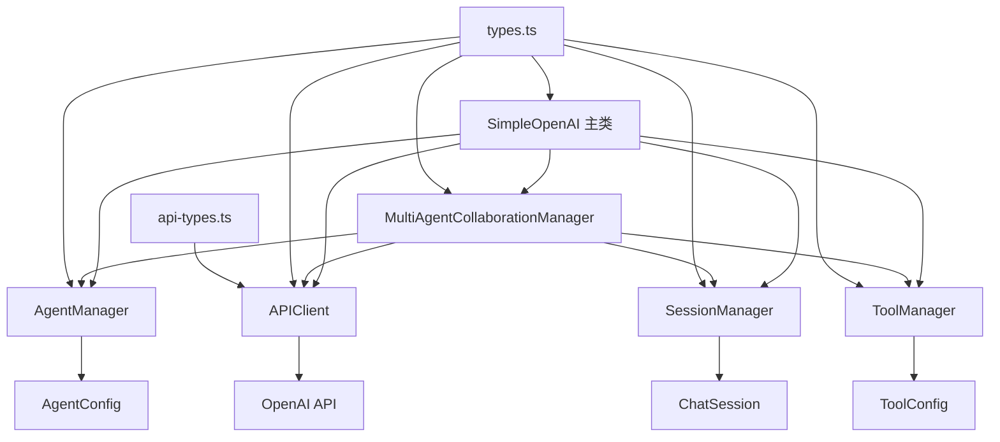
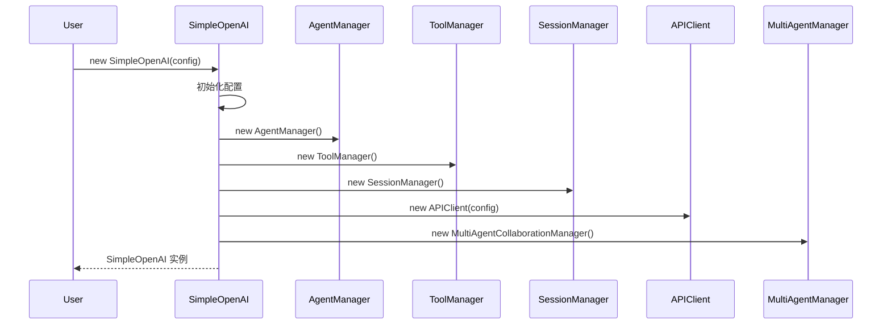
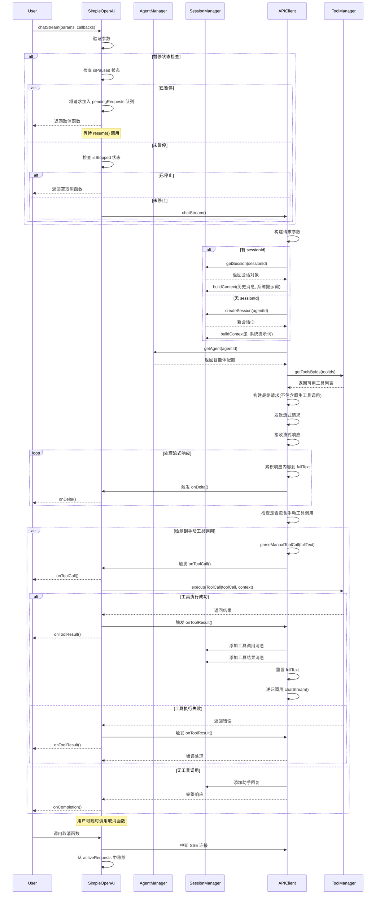
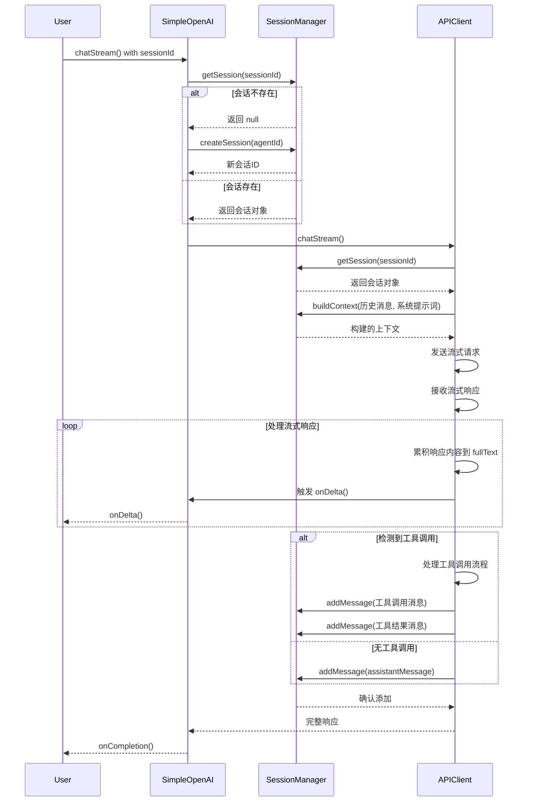
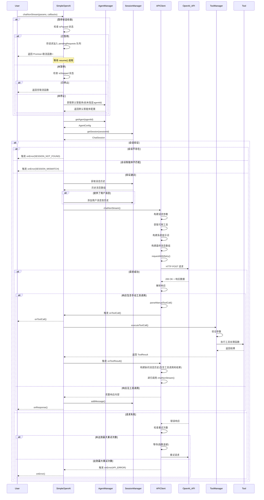
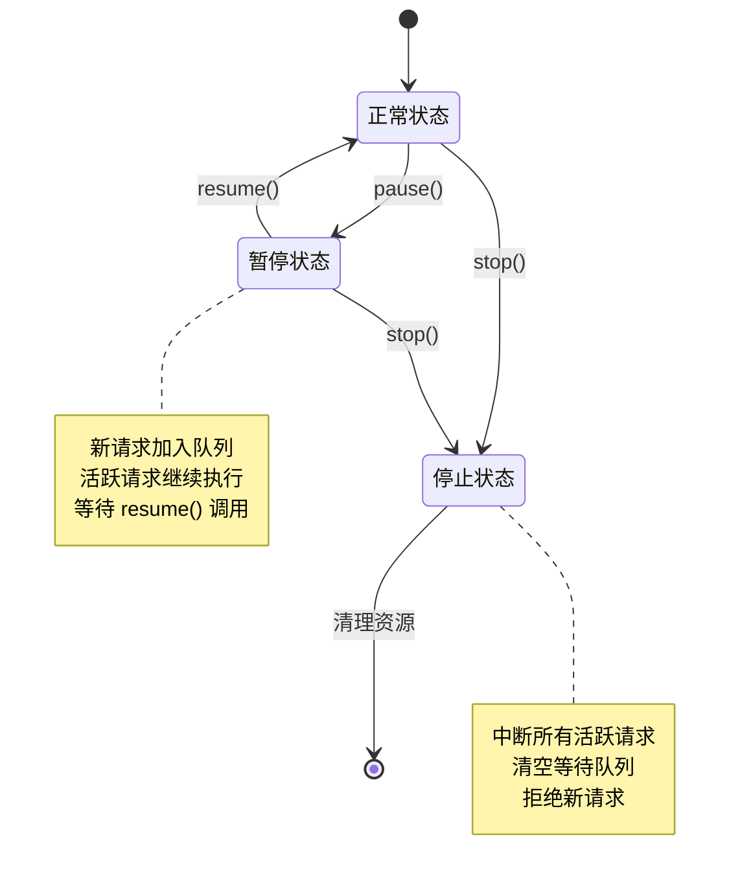
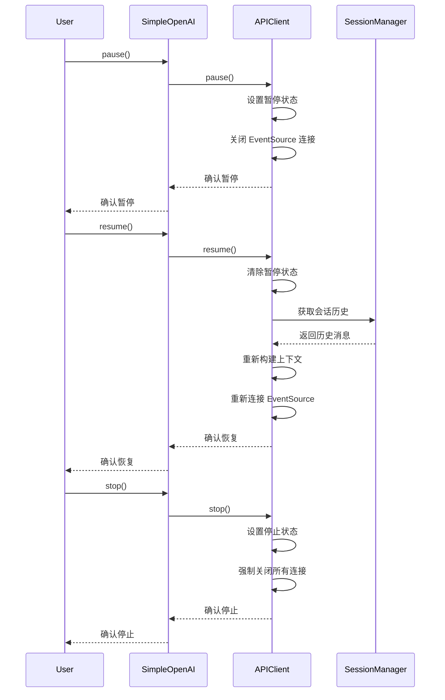
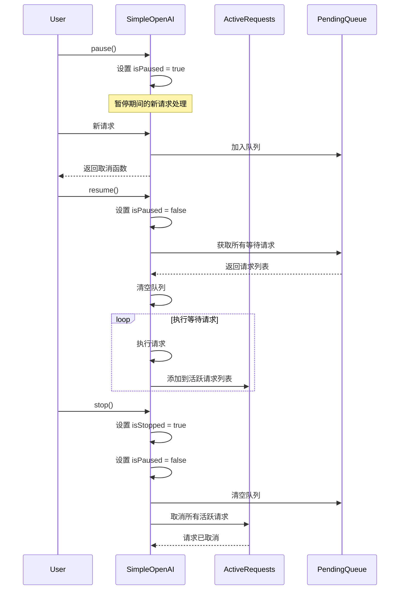
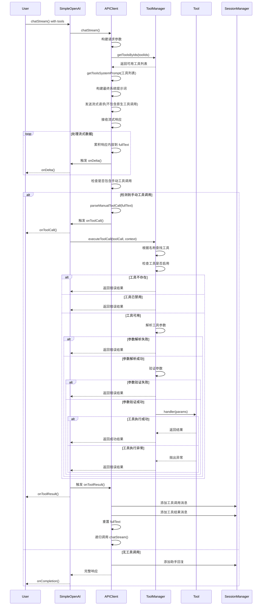
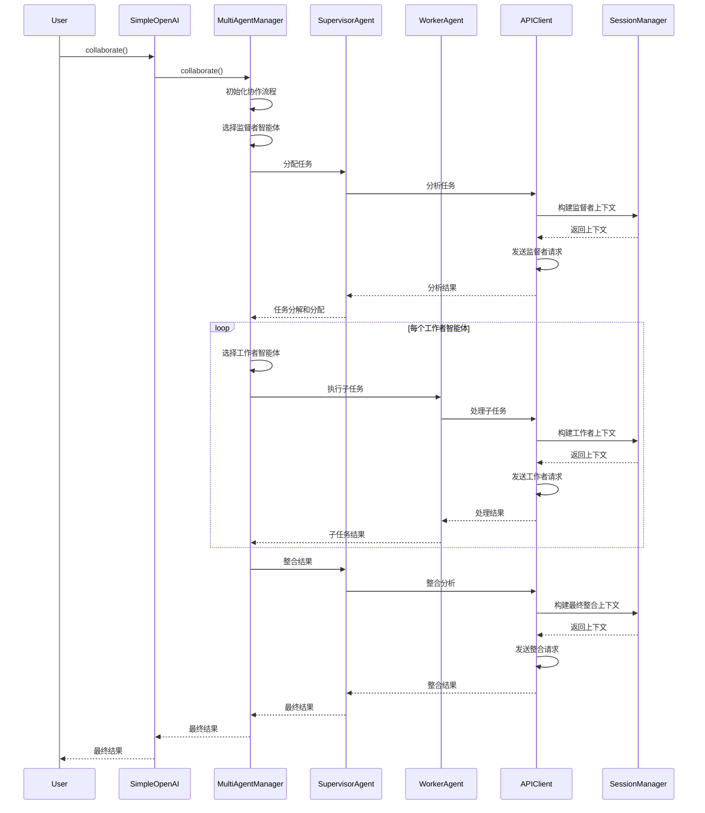

# SimpleOpenAI 库文档

## 概述

SimpleOpenAI 是一个模块化的 AI 对话库，提供了与 OpenAI API 交互的高级接口。该库支持多智能体、工具调用、会话管理和多智能体协作等功能，采用模块化设计，使代码结构清晰、易于维护和扩展。

## 架构设计

### 核心组件

SimpleOpenAI 库由以下核心组件组成：

1. **SimpleOpenAI** - 主类，提供统一的API接口
2. **AgentManager** - 智能体管理器，负责管理AI智能体
3. **APIClient** - API客户端，处理与OpenAI API的交互
4. **SessionManager** - 会话管理器，负责管理聊天会话
5. **ToolManager** - 工具管理器，负责管理AI可调用的工具
6. **MultiAgentCollaborationManager** - 多智能体协作管理器
7. **types.ts** - 核心类型定义
8. **api-types.ts** - API响应类型定义

### 模块关系



## 实现方式

### 1. 智能体管理 (AgentManager)

智能体管理器负责管理所有注册的智能体，提供注册、查询、默认设置和路由功能。

- **智能体注册**：通过 `registerAgent` 方法注册智能体配置
- **智能体查询**：通过 `getAgent` 和 `getAllAgents` 方法查询智能体
- **默认智能体**：通过 `setDefaultAgent` 和 `getDefaultAgent` 方法管理默认智能体
- **智能路由**：通过 `routeToAgent` 方法根据用户输入智能选择最合适的智能体

### 2. 工具管理 (ToolManager)

工具管理器负责管理AI可调用的工具系统，包括工具注册、执行、参数验证和格式转换等功能。

- **工具注册**：通过 `registerTool` 方法注册工具配置
- **工具执行**：通过 `executeToolCall` 和 `executeToolCalls` 方法执行工具调用
- **参数验证**：自动验证工具调用的参数类型和必需性
- **格式转换**：提供 `toolsToOpenAIFormat` 和 `getToolsSystemPrompt` 方法支持不同格式的工具调用

### 3. 会话管理 (SessionManager)

会话管理器负责管理聊天会话的生命周期，包括会话创建、查询、更新和删除等功能。

- **会话创建**：通过 `createSession` 方法创建新会话
- **消息管理**：通过 `addMessage` 和 `getMessages` 方法管理会话消息
- **上下文构建**：通过 `buildContext` 方法构建发送给API的上下文
- **会话切换**：通过 `switchSessionAgent` 方法切换会话的智能体

### 4. API客户端 (APIClient)

API客户端负责处理与OpenAI API的所有交互，包括流式和非流式请求、重试逻辑和错误处理。

- **流式请求**：通过 `chatStream` 方法处理流式对话
- **非流式请求**：通过 `chatNonStream` 方法处理非流式对话
- **重试机制**：内置指数退避重试逻辑
- **手动工具调用**：支持通过系统提示词实现手动工具调用

### 5. 多智能体协作 (MultiAgentCollaborationManager)

多智能体协作管理器负责协调多个智能体之间的协作，实现复杂问题的分布式解决。

- **代理工具创建**：将其他智能体封装为当前智能体可以调用的工具
- **协作模式**：采用 Supervisor 模式，第一个智能体作为 Supervisor，其他作为 Tools
- **临时会话管理**：为协作过程创建临时会话

## 使用方式

### 基本使用

```typescript
import { SimpleOpenAI } from './SimpleOpenAI';

// 初始化 SimpleOpenAI 实例
const simpleOpenAI = new SimpleOpenAI({
  apiKey: 'your-api-key',
  baseURL: 'https://api.openai.com/v1',
  defaultModel: 'gpt-3.5-turbo',
  defaultTemperature: 0.7
});

// 注册智能体
simpleOpenAI.registerAgent({
  id: 'assistant',
  name: 'Assistant',
  systemPrompt: 'You are a helpful assistant.',
  model: 'gpt-3.5-turbo',
  temperature: 0.7
});

// 创建会话
const sessionId = simpleOpenAI.createSession('assistant');

// 流式对话
const cancelStream = simpleOpenAI.chatStream({
  sessionId,
  message: 'Hello, how are you?',
  agentId: 'assistant'
}, {
  onDelta: (delta) => console.log(delta),
  onCompletion: (fullText) => console.log('Complete:', fullText),
  onError: (error) => console.error('Error:', error)
});
```

### 工具使用

```typescript
// 注册工具
simpleOpenAI.registerTool({
  id: 'weather',
  name: 'get_weather',
  description: 'Get the current weather for a location',
  parameters: {
    location: {
      type: 'string',
      description: 'The city and state, e.g. San Francisco, CA',
      required: true
    }
  },
  handler: async (params) => {
    // 实际获取天气的逻辑
    return { temperature: 72, condition: 'sunny' };
  }
});

// 使用工具的对话
const cancelStream = simpleOpenAI.chatStream({
  sessionId,
  message: 'What is the weather in New York?',
  agentId: 'assistant',
  tools: ['weather']
}, {
  onDelta: (delta) => console.log(delta),
  onToolCall: (toolCall) => console.log('Tool called:', toolCall),
  onToolResult: (result) => console.log('Tool result:', result),
  onCompletion: (fullText) => console.log('Complete:', fullText)
});
```

### 多智能体协作

```typescript
// 注册多个智能体
simpleOpenAI.registerAgent({
  id: 'researcher',
  name: 'Researcher',
  systemPrompt: 'You are a research assistant.',
  model: 'gpt-3.5-turbo'
});

simpleOpenAI.registerAgent({
  id: 'writer',
  name: 'Writer',
  systemPrompt: 'You are a writing assistant.',
  model: 'gpt-3.5-turbo'
});

// 多智能体协作
const cancelCollaboration = simpleOpenAI.collaborate({
  agentIds: ['researcher', 'writer'],
  message: 'Research and write a short article about renewable energy.'
}, {
  onAgentResponse: (agentId, response) => console.log(`${agentId}: ${response}`),
  onFinalResponse: (response) => console.log('Final result:', response),
  onError: (error) => console.error('Error:', error)
});
```

## 核心执行流程

### 初始化流程



### 单智能体流式对话详细流程



### 会话管理流程



### 非流式对话详细流程



### 暂停与恢复流程



### 暂停/恢复流程





### 工具调用详细流程



### 多智能体协作流程



## 特性

### 1. 模块化设计

SimpleOpenAI 采用模块化设计，各组件职责清晰，便于维护和扩展。

### 2. 多智能体支持

支持注册和管理多个智能体，每个智能体可以有独立的系统提示词、模型和参数。

### 3. 工具系统

支持工具注册、参数验证和执行，允许AI调用外部功能。

### 4. 会话管理

提供完整的会话生命周期管理，支持消息历史记录和上下文构建。

### 5. 流式和非流式对话

同时支持流式和非流式对话模式，满足不同场景需求。

### 6. 多智能体协作

支持多个智能体协作解决复杂问题，采用 Supervisor 模式。

### 7. 错误处理和重试

内置错误处理和重试机制，提高系统稳定性。

### 8. 暂停和恢复

支持暂停和恢复所有AI接口调用，便于资源管理。

## 扩展性

SimpleOpenAI 的模块化设计使其具有良好的扩展性：

1. **自定义智能体**：可以通过实现 `AgentConfig` 接口创建自定义智能体
2. **自定义工具**：可以通过实现 `ToolConfig` 接口添加自定义工具
3. **自定义API客户端**：可以扩展 `APIClient` 类支持其他API
4. **自定义会话管理**：可以扩展 `SessionManager` 类实现自定义会话存储

## 兼容性

SimpleOpenAI 兼容：

- Web 浏览器
- React Native
- Node.js

## 错误和限制

### 已知问题

1. **工具调用机制限制**：
   - 当前仅支持手动工具调用，不支持 OpenAI 原生工具调用
   - 工具调用依赖于 AI 模型正确识别和格式化工具调用请求

2. **会话管理限制**：
   - 会话历史长度限制可能导致上下文丢失
   - 不支持会话的持久化存储

3. **多智能体协作限制**：
   - 协作流程相对简单，缺乏复杂的任务分解策略
   - 不支持动态智能体选择

### 性能考虑

1. **内存使用**：
   - 会话历史存储在内存中，长时间运行可能占用较多内存
   - 工具调用结果也会存储在内存中

2. **网络请求**：
   - 流式对话需要保持长连接
   - 工具调用会增加额外的网络请求

3. **并发限制**：
   - 同一时间只能有一个活跃的流式对话
   - 工具调用会阻塞当前对话

## 注意事项

1. **API密钥安全**：请妥善保管OpenAI API密钥，不要在客户端代码中暴露
2. **Token限制**：注意OpenAI API的Token限制，合理设置 `maxHistoryLength` 和 `maxTokens`
3. **错误处理**：始终实现 `onError` 回调以处理可能的错误
4. **资源管理**：在不需要时调用取消函数以释放资源
5. **工具参数验证**：确保工具参数定义准确，避免参数验证失败